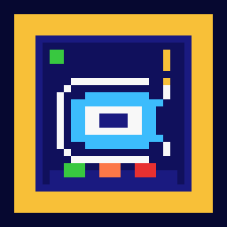

# GamePartner

<p align="center">
  
</p>

<p align="center">
  <strong>Local-first AI gaming companion — no cloud, no memory reading, no cheating.</strong>
</p>

A local-first AI gaming companion that runs entirely on your machine.
It watches your screen, understands game state, and surfaces real-time
tactical suggestions through a minimal always-on-top overlay — with no
cloud dependency and no game memory reading.

> **Current status:** MVP — Valorant HUD support. Architecture is game-agnostic;
> adding new game profiles requires only a `profile.json` + `detector.py`.

---

## How it works

```
Screen
  │  mss (2 FPS)
  ▼
Vision service  ──── OpenCV + Tesseract OCR ────► raw detections
  │                  (src/services/vision/)
  │  POST /ingest
  ▼
Agent service   ──── EventNormalizer ────────────► canonical events
  │             ──── DecisionEngine ──────────────► filtered decisions
  │                  (src/services/agent/)
  │  WebSocket /decisions
  ▼
Overlay         ──── Electron always-on-top window
                     (src/overlay/)
```

All services run as child processes managed by an Electron launcher. They
communicate over localhost HTTP + WebSocket. Nothing leaves your machine.

---

## Requirements

| Dependency | Version | Notes |
|---|---|---|
| Node.js | ≥ 18 | |
| Python | ≥ 3.10 | |
| Tesseract OCR | ≥ 5.0 | [Windows installer](https://github.com/UB-Mannheim/tesseract/wiki) |
| Valorant | Any | At 1920×1080 for default ROIs |

---

## Quick start

```bash
# 1. Clone
git clone https://github.com/Zwin-ux/botbot2.git
cd botbot2

# 2. Node dependencies
npm install

# 3. Python dependencies
pip install -r src/services/vision/requirements.txt

# 4. Install Tesseract (Windows)
#    https://github.com/UB-Mannheim/tesseract/wiki
#    Default install path: C:\Program Files\Tesseract-OCR\

# 5. Launch
npm start
```

The Electron tray icon appears. The overlay shows in the top-right corner of
your primary monitor. Start Valorant — the overlay will populate once the
vision service detects HUD elements.

---

## Calibrating ROIs

The default ROI coordinates target **1920×1080** with Valorant's standard HUD
scale. If your resolution or HUD scale differs, calibrate before use:

```bash
# Take a screenshot while in a Valorant match, then:
python tools/calibrate_rois.py --screenshot path/to/screenshot.png

# Or capture your screen live:
python tools/calibrate_rois.py --capture
```

**Calibrator controls:**

| Key | Action |
|---|---|
| `N` / Tab | Next field |
| `P` | Previous field |
| `E` | Draw new ROI (click + drag) |
| `T` | Test OCR on selected field |
| `A` | Test all fields |
| `W` `A` `S` `D` | Nudge 1 px |
| `Shift` + WASD | Nudge 5 px |
| `+` / `-` | Grow / shrink |
| `S` | Save to `profile.json` |
| `R` | Reset to last saved value |
| `Q` | Quit |

Fields turn green in the sidebar when OCR reads a valid value.

---

## Testing without the game

```bash
# Run the detector on a single screenshot and print structured JSON
python src/services/vision/server.py --test screenshot.png

# Batch-test a folder of screenshots
python src/services/vision/server.py --replay recordings/ --game valorant

# Run normalizer unit tests (no dependencies needed)
node tests/test_normalizer.js
```

---

## Project structure

```
gamepartner/
├── config/
│   └── default.json          # ports, FPS, overlay settings
├── src/
│   ├── launcher/
│   │   ├── main.js           # Electron entry — tray, IPC, window lifecycle
│   │   └── orchestrator.js   # Spawns child services, health-polls, reconnects
│   ├── events/
│   │   ├── schema.js         # EVENT_TYPES + createEvent()
│   │   └── normalizer.js     # Raw detections → canonical GameEvents
│   ├── services/
│   │   ├── agent/
│   │   │   ├── index.js      # HTTP + WebSocket server (port 7701)
│   │   │   ├── core.js       # AgentCore — session management, pipeline
│   │   │   └── decision_engine.js  # Priority, cooldown, confidence, conflicts
│   │   ├── vision/
│   │   │   ├── server.py     # HTTP server (port 7702) + FPS capture loop
│   │   │   ├── capture.py    # mss screen grabber
│   │   │   ├── detect.py     # Stateful dispatcher + smoother bank
│   │   │   ├── smoothing.py  # Numeric / Boolean / Text smoothers
│   │   │   └── roi.py        # Crop, scale, OCR preprocessing
│   │   └── storage/
│   │       ├── index.js      # SQLite REST API (port 7703)
│   │       └── schema.js     # DB init, WAL mode
│   ├── overlay/
│   │   ├── window.js         # BrowserWindow factory (always-on-top)
│   │   ├── preload.js        # contextBridge → gp.*
│   │   ├── index.html        # Minimal HUD panel
│   │   └── renderer.js       # Decision events → DOM
│   └── profiles/
│       └── valorant/
│           ├── profile.json  # ROIs + declarative rule set
│           └── detector.py   # CV/OCR per-frame implementation
├── tools/
│   └── calibrate_rois.py     # Interactive ROI calibration tool
├── tests/
│   └── test_normalizer.js    # Normalizer fixture tests (node tests/...)
└── scripts/
    └── build.js              # Pre-build validator + electron-builder
```

---

## Service ports

| Service | Port | Protocol |
|---|---|---|
| Agent | 7701 | HTTP + WS `/events` + WS `/decisions` |
| Vision | 7702 | HTTP |
| Storage | 7703 | HTTP |

---

## Adding a new game profile

1. Copy `src/profiles/valorant/` → `src/profiles/<game>/`
2. Edit `profile.json`:
   - Update `resolution`, `hud` ROI coordinates, and `rules`
3. Implement `detector.py` — expose one function:
   ```python
   def detect(frame: np.ndarray, profile: dict) -> dict:
       # Return: { health, credits, phase, round_number, abilities, spike_state }
   ```
4. Set `"activeProfile": "<game>"` in `config/default.json`
5. Calibrate: `python tools/calibrate_rois.py --capture --game <game>`

---

## Architecture notes

- **Event-driven, not chat-driven** — the agent reacts to game state changes,
  never initiates conversation.
- **Two WS channels** — `/events` carries all telemetry (for storage/debug);
  `/decisions` carries only filtered, scored outputs (for the overlay).
- **Temporal smoothing** — vision runs at 2 FPS with OCR. Smoothers in
  `detect.py` prevent single bad frames from producing false events.
- **Confidence gates** — every field goes through a 0.40 confidence threshold
  before the normalizer will update state or emit an event.
- **Declarative rules** — game logic lives in `profile.json`, not code.
  Priority, cooldown, and context escalation are all JSON-configurable.

---

## License

MIT
