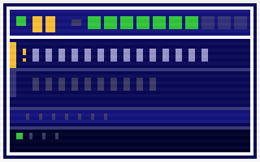

# GamePartner

<p align="center">
  
</p>

<p align="center">
  
  
  
</p>

<p align="center">
  <a href="https://github.com/Zwin-ux/botbot2/releases/latest">
    
  </a>
</p>

<p align="center">
  <strong>Your AI Player 2 &nbsp;&bull;&nbsp; Always available &nbsp;&bull;&nbsp; 100% local</strong>
</p>

<p align="center">
  
</p>

---

## Install in 3 steps

1. Click **Download** above and save `GamePartner-Setup.exe`
2. Run it and follow the setup wizard (takes about a minute)
3. Pick your game and hit **Launch** — the overlay appears automatically

> **Windows SmartScreen warning?**
> Click **"More info"** then **"Run anyway"** — the app is safe but unsigned.

---

## What it does

GamePartner watches your screen while you play and shows real-time tips in a small overlay — like having a coach in the corner of your monitor. Drop the EXE and you always have a Player 2.

- Reads game state directly from screen pixels (no game files touched, no injection)
- Shows contextual suggestions as you play
- Works 100% offline — nothing leaves your PC
- Supports any windowed or fullscreen game with visible HUD elements

**Supported games:**

| Game | Status | What it reads |
|------|--------|---------------|
| **Minesweeper** | Ready | Mine count, timer, win/lose state |
| **Solitaire** | Ready | Score, move count, game state |
| **Valorant** | Beta | HP, credits, abilities, round phase, kill feed |
| **CS2** | Beta | HP, money, round phase |

> **Quick start:** Open Minesweeper or Solitaire, launch GamePartner, pick the game — the overlay starts reading your game state immediately. No config needed.

---

## Overlay controls

| Shortcut | Action |
|---|---|
| `Ctrl + Shift + G` | Show / hide overlay |
| Click & drag overlay | Move it anywhere |
| Right-click tray icon | Settings, restart services, quit |

---

## For developers

```bash
git clone https://github.com/Zwin-ux/botbot2.git
cd botbot2
npm install
pip install -r src/services/vision/requirements.txt
npm start
```

**Build the installer yourself:**
```bash
pip install pyinstaller
npm run dist        # PyInstaller + electron-builder → dist/installer/*.exe
```

**Run tests (no game, no Tesseract needed):**
```bash
npm test            # JS normalizer + decision engine (117 tests)
npm run test:python # Python vision + Minesweeper detector (83 tests)
npm run test:all    # Everything (200 tests)
```

---

## Architecture

```
Vision (Python :7702)  →  Agent (Node :7701)  →  Overlay (Electron)
                                  ↓
                        Storage (SQLite :7703)
```

Everything runs locally. The Electron launcher manages all services as child processes.
Adding a new game requires only `profile.json` + `detector.py` in `src/profiles/<game>/`.

---

## Troubleshooting

**Overlay shows "START [GAME] TO ACTIVATE" but I'm playing**
The game window title must contain the expected name (e.g. "Minesweeper").
GamePartner auto-detects the window by title. Check: right-click tray icon > View Logs.

**Everything shows dashes and no alerts appear**
Tesseract OCR may not be installed or wasn't found. Right-click tray > View Logs and look
for `[vision] Tesseract not available`. Fix: delete `%APPDATA%\GamePartner\setup-complete.json`
and relaunch to re-run the setup wizard.

**Detection seems wrong or inaccurate**
Default ROIs are calibrated for 1920x1080. At other resolutions, accuracy may drop.
Use `python tools/calibrate_rois.py --capture` to recalibrate for your resolution.

**How do I switch games?**
Right-click the tray icon > Switch Game > pick your game. Vision service restarts automatically.

**Service crashed / overlay shows RETRY button**
Click RETRY in the overlay, or right-click tray > Services > Restart Vision.
If it keeps crashing, check tray > View Logs for the error.

**How do I re-run the setup wizard?**
Delete `%APPDATA%\GamePartner\setup-complete.json` and relaunch the app.

---

## License

MIT
